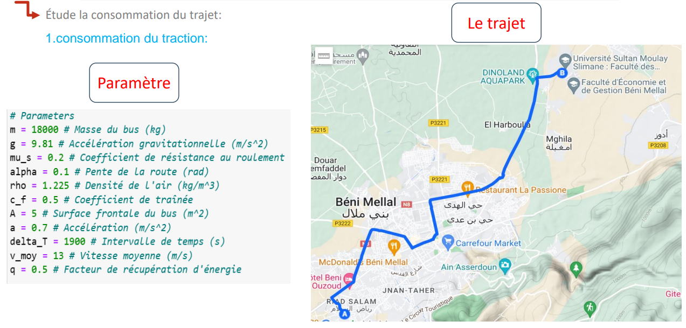
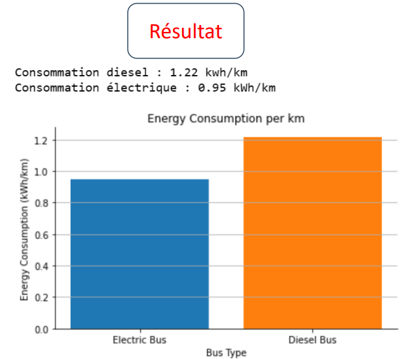
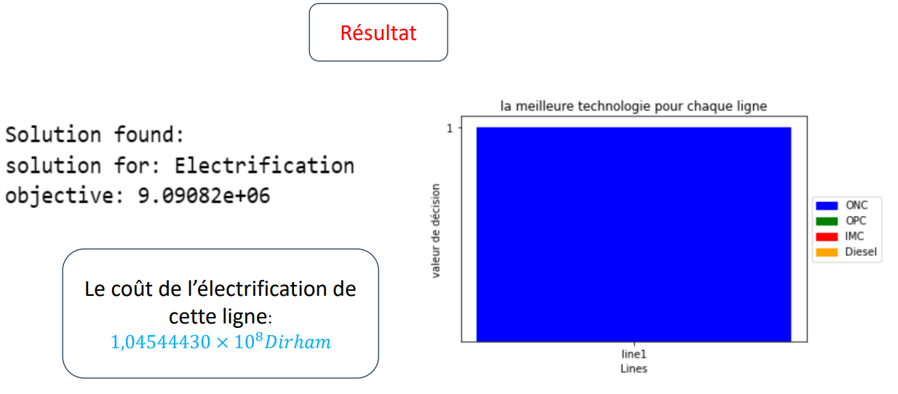

<h1 align="center">🚍 La transition vers les bus électriques</h1>

Un projet d'étude et d'analyse de la transition des bus thermiques vers les bus électriques, en prenant en compte les aspects technologiques, économiques et environnementaux.

## 🌍 Introduction

Ce projet explore les impacts de la transition énergétique sur les transports publics en se focalisant sur les bus électriques. Les principaux objectifs incluent :
- La réduction des émissions de gaz à effet de serre.
- L'amélioration de la qualité de vie en milieu urbain.
- La diminution de la dépendance aux énergies fossiles.

## 📚 Contenu

Le projet est structuré autour des thématiques suivantes :
1. **Problématique** : Analyse des enjeux climatiques, politiques et industriels.
2. **Technologies disponibles** : Comparaison des solutions technologiques pour les bus électriques.
3. **Modèles de calcul énergétique** : Études sur la consommation et la récupération d'énergie.
4. **Études économiques** : Analyse coût-avantage de l'électrification des lignes de bus.

## 📊 Résultats attendus

- Identification des technologies optimales pour chaque ligne de bus.
- Modélisation énergétique pour réduire les coûts et augmenter l'efficacité.
- Impact environnemental positif grâce à la transition vers les bus électriques.

## 🖼️ Aperçu

Voici une représentation graphique des analyses :

  

  

  

## 🛠️ Outils et méthodes

- **Outils** : docplex, matplotlib, IBM ILOG CPLEX Optimisation Studio.
- **Modèles énergétiques** : Modèles de traction, récupération d'énergie, confort thermique.
- **Données** : Consommation énergétique, émissions de CO2, coût opérationnel.

